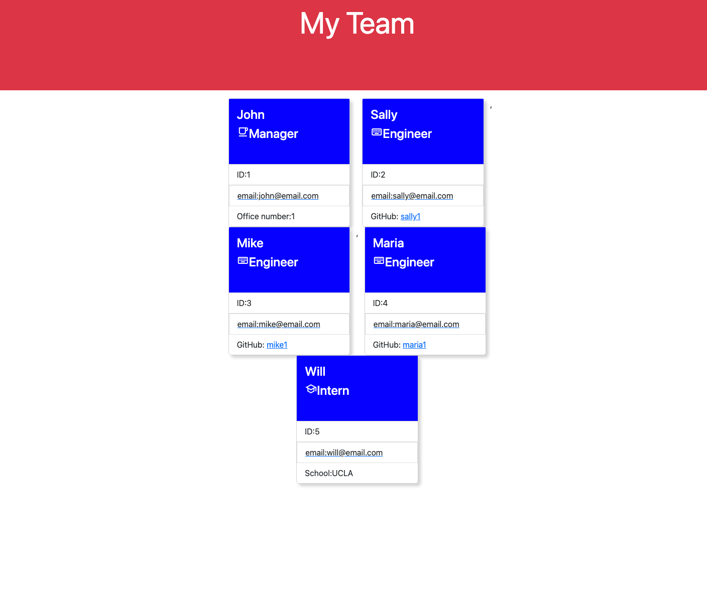

# team-profile-generator
***
## Description
This is an application that lets the user build a profile of their team members by answering a few questions. 
***
## Table of Contents
- [Installation](#installation)
- [Usage](#usage)
- [Contributing](#contributing)
- [License](#license)
- [Test](#test)
- [Questions](#questions)
***
## Installation
No installation is required. The application runs on the terminal. 
***
## Usage
Simply type "node index.js" in the terminal. Watch the video for more details. 
https://drive.google.com/file/d/1Rp-WnnNDXnA94tKpyYodMcacBVOLlui_/view
***
## Contributing
N/A
***
## License

## Test
There are four test to make sure the functions for employee, engineer, intern, and manager are running correctly. 
***
## Questions
- https://github.com/armando1236
- For additional questions please email me at: amjr86@outlook.com

